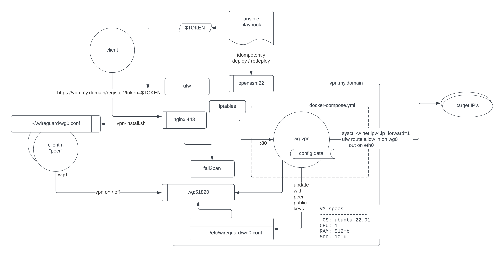
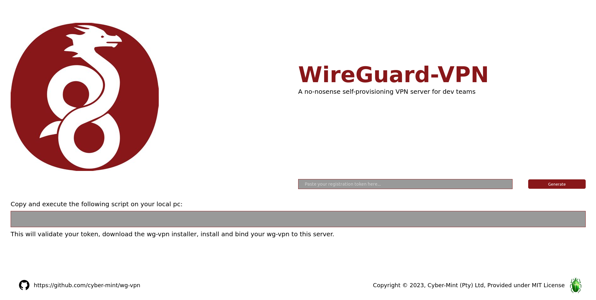

[](https://dl.circleci.com/status-badge/redirect/gh/Cyber-Mint/wg-vpn/tree/master)

# Wireguard VPN

> Wireguard VPN (`wg-vpn`) is an ultra-light implementation of a simplified configuration service for Wireguard deployments,  designed for use with Linux clients.

### Overview

`wg-vpn` makes use of [Wireguard](https://www.wireguard.com/), which is a lightweight, fast, secure, and relatively new Virtual Private Network (VPN), that supports IPv4 and IPv6 connections. The encryption in Wireguard works by utilizing public and private keys to establish an encrypted "tunnel".

> **References**: Digital-Ocean Wireguard [tutorial](https://www.digitalocean.com/community/tutorials/how-to-set-up-wireguard-on-ubuntu-22-04)

---

## Administrator Documentation

The Wireguard VPN service is deployable by an administrator to any VM cloud instance using an Ansible playbook. It serves as a great companion to the `wg-quick` script and `wg` VPN.

**Deployment Topology**

The following diagram illustrates the deployment topology for `wg-vpn`.


Please refer to the [technical documentation](docs/README.md) for how to deploy the `wg-vpn` server to production or to a local VM for testing.

## Client Documentation

The Wireguard VPN service allows users (also known as peers) to self-register and configure their client instances to make use of the `wg-vpn` virtual private network.

### Setup Procedure for Clients
- Users self-register by visiting https://vpn.my.domain. The user will presented with the following screen.



- The Administrator would have provided the User with a **`TOKEN`** which then is pasted into the landing page and **GENERATE** will generate a one line script like the one below for the user to copy and execute on their local PC.
```bash
curl -sSL -H "Authorization: Bearer TOKEN" https://vpn.my.domain/register -o wg-vpn-installer.sh && bash wg-vpn-installer.sh
```
- This will install and tether `wg-vpn` to the server `vpn.my.domain`. 


> The installation includes the necessary dependencies, `wg` and `wg-quick`, and configures the `~/.wireguard/wg0.conf` file. <br>

<br>

After executing the script, users can see the capabilities of the application by executing  `wg-vpn --help`.

<br>

```text
Usage wg-vpn [COMMAND].. [OPTION]
   wg-vpn is a WireGuard wrapper to easily run a peer with a wg-vpn server

  [COMMAND]:
    up,UP           bring the peer VPN connection up
    down,DOWN       bring the peer VPN connection down
    uninstall       uninstall wg-vpn

  [OPTION]:
    -q, --quiet     produces no terminal output,
                    except setting bash return value \$? = 1 if failures found.
        --version   display the version and exit
        --help      display this help and exit


  EXAMPLE(s):
      wg-vpn up -q
      wg-vpn down
      wg-vpn status
```

### Uninstalling

To remove the client installation simply executing `wg-vpn uninstall` which will remove the application completely and the local user specific `wg0.conf` file.
<br>

---
Copyright &copy; 2023, Cyber-Mint (Pty) Ltd<br>
Supplied under [MIT License](./LICENSE)

